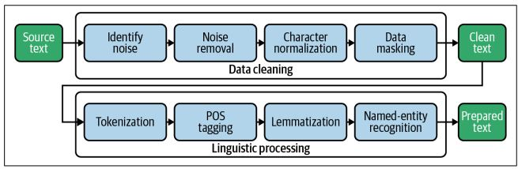

# Spam Classifer

This repo explains the basic steps to perform on text data to classify the text messages as

Creating conda env

```
conda create -p venv python==3.7 -y
```

Activate conda env

```
conda activate venv/
```

Install requirements.txt

```
pip install -r requirements.txt
```

### Data Preprocessing Pipeline


